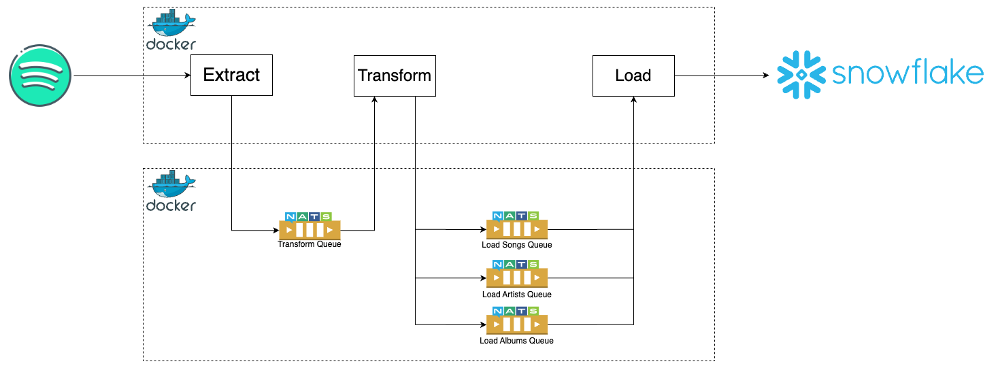

Spotify Data Pipeline
=========================

## Overview
This project is a data pipeline that extracts data from Spotify, transforms it, and loads it into a Snowflake database. The pipeline uses NATS as a message broker to handle the data flow between the different components.

## Architecture Diagram
The architecture diagram below illustrates the overall structure of the data pipeline, including the interaction between the extract, transform, and load components, as well as the role of NATS as the message broker to facilitate data flow.

## Components
**Extract**: Extracts data from Spotify using the Spotify API.  
**Transform**: Transforms the extracted data into a format suitable for loading into Snowflake.  
**Load**: Loads the transformed data into Snowflake.   

## Requirements
- Docker
- Snowflake
- Spotify API credentials

## Setup
Fill in the values for the following environment variables in the .env file:  
- SPOTIFY_CLIENT_ID
- SPOTIFY_CLIENT_SECRET
- PLAYLIST_ID
- SNOWFLAKE_USER
- SNOWFLAKE_PASSWORD
- SNOWFLAKE_ACCOUNT
- SNOWFLAKE_WAREHOUSE
- SNOWFLAKE_DATABASE
- SNOWFLAKE_SCHEMA

## Pipeline Flow
- The extract component extracts data from Spotify and sends it to the ARTISTS_QUEUE, SONGS_QUEUE, and ALBUMS_QUEUE NATS subjects.  
- The transform component consumes the data from the NATS subjects, transforms it, and sends it to the TRANSFORM_QUEUE NATS subject.   
- The load component consumes the transformed data from the TRANSFORM_QUEUE NATS subject and loads it into Snowflake.   

## Cron Schedule
The pipeline is scheduled to run according to the cron syntax in yacron scheduler config file `yacron.conf`.

## Notes
- This pipeline assumes that the Spotify API credentials are valid and that the Snowflake database is properly configured.  
- The pipeline uses the spotipy library to interact with the Spotify API.  
- The pipeline uses the snowflake-connector-python library to interact with Snowflake.  
- The pipeline uses the nats-py library to interact with NATS.  
